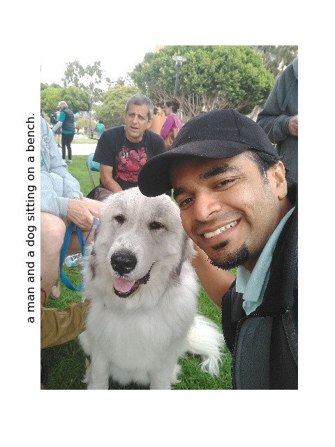
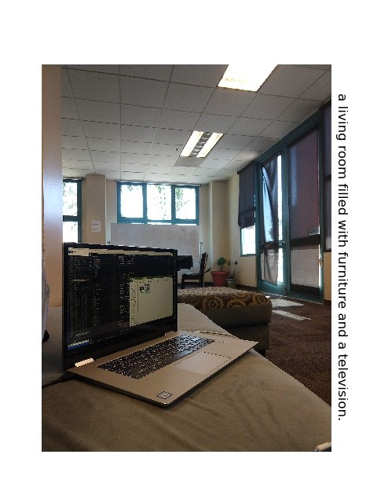
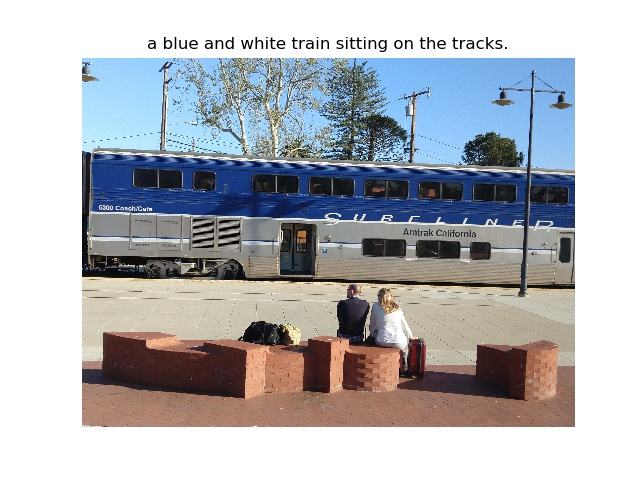

### Introduction
This neural system for image captioning is roughly based on the paper "Show, Attend and Tell: Neural Image Caption Generation with Visual Attention" by Xu et al. (ICML2015). The input is an image, and the output is a sentence describing the content of the image. It uses a convolutional neural network to extract visual features from the image, and uses a LSTM recurrent neural network to decode these features into a sentence. A soft attention mechanism is incorporated to improve the quality of the caption. This project is implemented using the Tensorflow library, and allows end-to-end training of both CNN and RNN parts.

### Setup
Look in cv_readme.txt document

### Prerequisites
* **Tensorflow** ([instructions](https://www.tensorflow.org/install/))
* **NumPy** ([instructions](https://scipy.org/install.html))
* **OpenCV** ([instructions](https://pypi.python.org/pypi/opencv-python))
* **Natural Language Toolkit (NLTK)** ([instructions](http://www.nltk.org/install.html))
* **Pandas** ([instructions](https://scipy.org/install.html))
* **Matplotlib** ([instructions](https://scipy.org/install.html))
* **tqdm** ([instructions](https://pypi.python.org/pypi/tqdm))
* **java** ([instructions](https://docs.oracle.com/javase/8/docs/technotes/guides/install/linux_jdk.html#A1098871))

### MS COCO 2014, images are distributed as follows 
* **Train = 82783**
* **Valid = 40504**
* **Tests = 40775**

### Usage
* **Preparation:** Download the COCO train2014 and val2014 data [here](http://cocodataset.org/#download). 
  * Put the COCO train2014 images in the folder `train/images`, and put the file `captions_train2014.json` in the folder `train`. 
  * Similarly, put the COCO val2014 images in the folder `val/images`, and put the file `captions_val2014.json` in the folder `val`. 
  * Furthermore, download the pretrained VGG16 net [here](https://app.box.com/s/idt5khauxsamcg3y69jz13w6sc6122ph) or ResNet50 net [here](https://app.box.com/s/17vthb1zl0zeh340m4gaw0luuf2vscne) if you want to use it to initialize the CNN part.

* Use a virtual environment for tf with GPU. 
  * Activate the Virtualenv and set the variables needed
    ```shell
    source ~/tf/bin/activate
    export LD_LIBRARY_PATH=${LD_LIBRARY_PATH:+${LD_LIBRARY_PATH}:}/usr/local/cuda/lib64/
    export LD_LIBRARY_PATH=${LD_LIBRARY_PATH:+${LD_LIBRARY_PATH}:}/usr/local/cuda/extras/CUPTI/lib64

    ```
  * Look at `nvidia-smi` output to know which GPU ID's are free for use. 
  * In a shared environment prefix all your commands with gpu identifier `CUDA_VISIBLE_DEVICES=0`
    ```shell
    CUDA_VISIBLE_DEVICES=2 python main.py --phase=train  --load --model_file=models/1829999.npy /
                                     --load_cnn --cnn_model_file=vgg16_no_fc.npy [--train_cnn]
    CUDA_VISIBLE_DEVICES=2 python main.py --phase=eval --model_file=models/1830034.npy --beam_size=3
    CUDA_VISIBLE_DEVICES=2 python main.py --phase=test --model_file=models/1830034.npy --beam_size=3
    ```

* Tensorboard  & Jupyter
  * To monitor the progress of training, run the following command
    ```shell
    tensorboard /usr/local/bin/tensorboard --logdir summary/ --port 8886
    ```
  * Jupyter notebook can be run as follows and then port forward based on this for access from a remote machine. Keep a note of the token for this instance to login.
    ```shell
    jupyter notebook --no-browser --port=8887
    ```

  * Tunnel and forward port on your local for Tensorboard(port = 8886) or Jupyter (port = 8887)
    ```shell
    ssh -N -L localhost:6006:localhost:8886 vishwakarma@xxxxxx.yyyy.edu http://localhost:6006
    ssh -N -L localhost:6007:localhost:8887 vishwakarma@xxxxxx.yyyy.edu http://localhost:6007
    ```

  * Run in background (nohup or tmux)
    
    ```shell
    # using nohup run in background and dumnp to a log file
    nohup python3 main.py --phase=train --load --model_file=models/10999.npy --load_cnn --cnn_model_file=vgg16_no_fc.npy [--train_cnn] >> run.log   &

    # Alternately use tmux (a cheatsheet is available in this repo)
    tmux new-session -s rhltf
    tmux attach-session -t rhltf
    ```

* **Training:**
  * Since the dataset is huge, we have added a variable in `config.py` file called   `self.train_data_count_limit = 100` to consider only 100 images for this phase. To run on all set it to 0 and ensure that there are images in the train folder along with the captions file.
  * To train a model using the COCO train2014 data, first setup various parameters in the file `config.py` and then run a command like this:
    ```shell
    python main.py --phase=train --load_cnn --cnn_model_file=vgg16_no_fc.npy [--train_cnn]    

    ```
  * Turn on `--train_cnn` if you want to jointly train the CNN and RNN parts. Otherwise, only the RNN part is trained. The checkpoints will be saved in the folder `models`. If you want to resume the training from a checkpoint, run a command like this:
    ```shell
    python main.py --phase=train  --load --model_file=models/1829999.npy [--train_cnn]
    ```

* **Evaluation:**
  * Since the dataset is huge, we have added a variable in `config.py` file called   `self.eval_data_count_limit = 100` to consider only 100 images for this phase. To run on all set it to 0 and ensure that the images and caption are in the val folder.
  * To evaluate a trained model using the COCO val2014 data, run a command like this:
    ```shell
    python main.py --phase=eval --model_file=models/1829999.npy --beam_size=3
    ```
  * The result will be shown in stdout. Furthermore, the generated captions will be saved in the file `val/results.json`.

* **Inference:**
  * You can use the trained model to generate captions for any JPEG images! Put such images in the folder `test/images`, and run a command like this:
    ```shell
    python main.py --phase=test --model_file=models/1829999.npy --beam_size=3
    ```
  * The generated captions will be saved in the folder `test/results`.

### Results

Provided my trained network (Epoch 100 on a NVIDIA Geforce 1080 Ti based Ubuntu server) downloadable [here](https://1drv.ms/f/s!AqHh2eQCcWu8g8VryxgPk0fihuGDDw) 
A pretrained model with default configuration can be downloaded [here](https://app.box.com/s/xuigzzaqfbpnf76t295h109ey9po5t8p). 
This model was trained on the COCO train2014 data. 

##### Metrics
It achieves the following BLEU scores on the COCO val2014 data (with `beam size=3`):
* **BLEU-1 = 69.4%**
* **BLEU-2 = 49.4%**
* **BLEU-3 = 35.4%**
* **BLEU-4 = 25.7%**

##### Images 
* Here are some captions generated by this model

People/Dogs                |  Room/Indoors
:-------------------------:|:-------------------------:
  |  


Train & outdoors           |
:-------------------------:|
 |


### References
* [Show, Attend and Tell: Neural Image Caption Generation with Visual Attention](https://arxiv.org/abs/1502.03044). Kelvin Xu, Jimmy Ba, Ryan Kiros, Kyunghyun Cho, Aaron Courville, Ruslan Salakhutdinov, Richard Zemel, Yoshua Bengio. ICML 2015.
* [Show and Tell: A Neural Image Caption Generator](https://arxiv.org/abs/1411.4555).By Oriol Vinyals, Alexander Toshev, Samy Bengio, Dumitru Erhan ICML 2015
* [Microsoft COCO dataset](http://mscoco.org/)
* [Blogpost describing soft attention in detail](https://blog.heuritech.com/2016/01/20/attention-mechanism/)
* [Lecture 8 on RNN, ](http://www.di.ens.fr/~lelarge/dldiy/slides/lecture_8/index.html#1)
* Implementations
  * [The original implementation in Theano](https://github.com/kelvinxu/arctic-captions)
  * [Neural Machine Translation (seq2seq) Tutorial](https://github.com/tensorflow/nmt)
  * [Neural Image Captioning by fregu856](https://github.com/fregu856/CS224n_project)
  * [Neural Image captioning by DeepRNN ](https://github.com/DeepRNN/image_captioning)
  * [An earlier implementation in Tensorflow](https://github.com/jazzsaxmafia/show_attend_and_tell.tensorflow)
  * [LSTM barebone numpy implementation](https://github.com/nicodjimenez/lstm)


